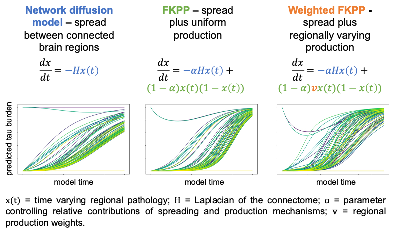

## Network Spreading Models Toolbox
Connectome-based models of disease propagation are used to probe mechanisms of
pathology spread in neurodegenerative disease. We present our network spreading model toolbox that allows the user to compare model fits across different models and parameters.

## Available models
- Network Diffusion Model(NDM)
  Pathology spreading between connected brain regions.
- Fisher-Kolmogorov-Petrovsky-Piscounov (FKPP)
  Spreading plus uniform local production
- Weighted-FKPP models
  Spreading plus regionally-varying production weighted by a vector of choice.
  It has been discovered [1,2] that weighting the production rate of FKPP with regional vectors improves the original FKPP model by taking into account the difference in the regional characteristics during disease progression. We define this new model as weighted FKPP and display its advantage using regional amyloid as the weight here.

Equations and simulated pathology over time are provided in the figure below:

## Get started
Run [NDM_optimisation_simulated_data.py](./code/NDM_optimisation_simulated_data.py) or [FKPP_optimisation_simulated_data.py](./code/FKPP_optimisation_simulated_data.py) to run example code for the NDM or the FKPP models. This selects optimal model parameters for each model using a simulated dataset.

## About us
This toolbox originated from project for CMICHACKS 2023.
The team included: Ellie, Anna, Tiantian, Neil, James, Antoine and Xin
  
## References
[1].	He, T., Schroder, A., Thompson, E., Oxtoby, N. P., Abdulaal, A., Barkhof, F., & Alexander, D. C. (2023). Coupled pathology appearance and propagation models of neurodegeneration. The Organization for Human Brain Mapping (OHBM) 2023 Annual Meeting, [Oral Presentation]

[2].	He, T., Thompson, E., Schroder, A., Oxtoby, N. P., Abdulaal, A., Barkhof, F., & Alexander, D. C. (2023, October). A coupled-mechanisms modelling framework for neurodegeneration. In International Conference on Medical Image Computing and Computer-Assisted Intervention (pp. 459-469). Cham: Springer Nature Switzerland.
https://link.springer.com/chapter/10.1007/978-3-031-43993-3_45

